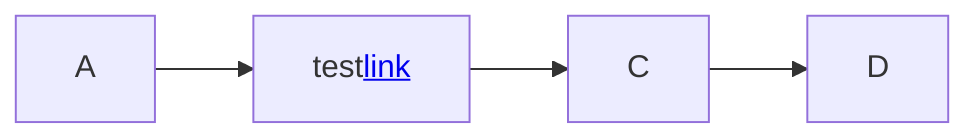

```mermaid
flowchart LR
    A-->B[test<a href='test.md'>link</a>]
    B-->C
    C-->D
    click A callback "Tooltip for a callback"
    click B "http://git.marine.gov.mo/cheonghk/test/src/branch/master/test.md" _blank
    click C call callback() "Tooltip for a callback"
    click D href "http://git.marine.gov.mo/cheonghk/test/src/branch/master/test.md" _blank
```
